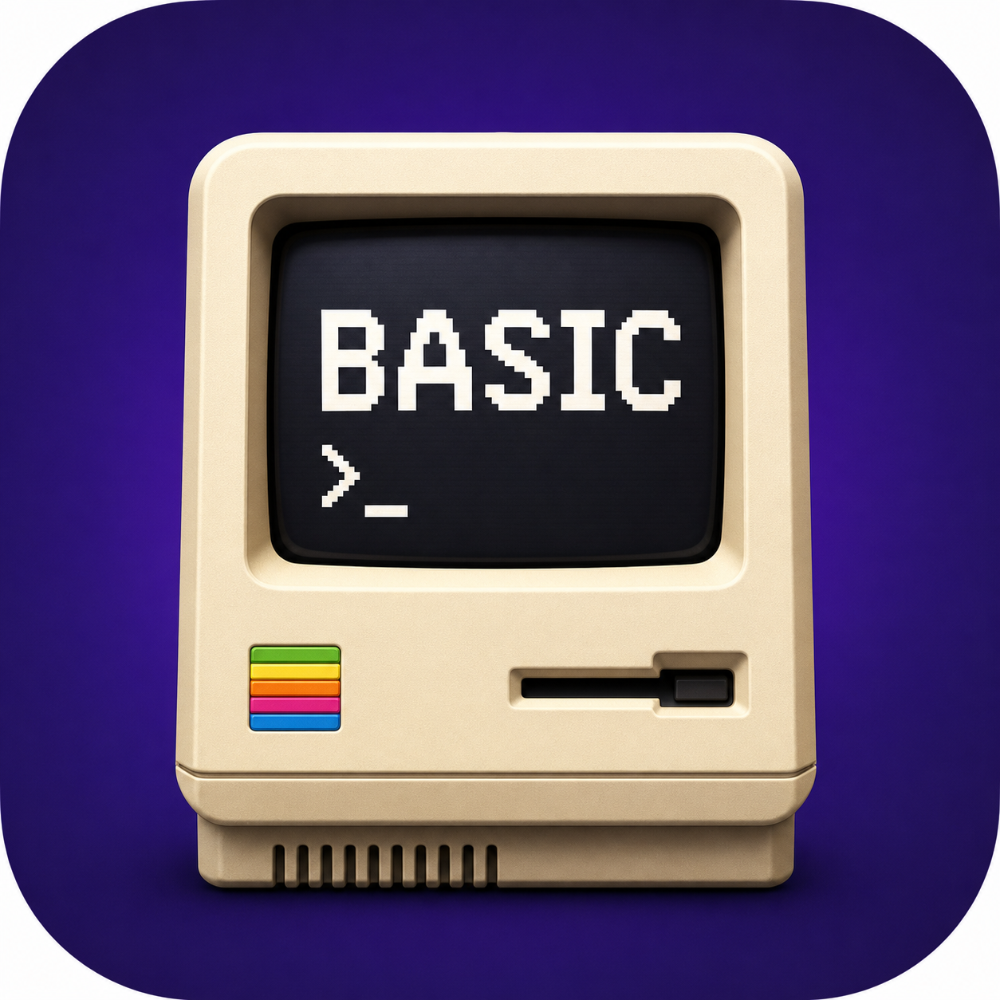
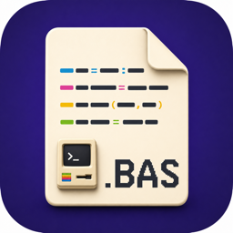

# MacBasic

MacBasic is a small, structured BASIC for macOS and GNUstep. It borrows the
immediacy of AmigaBASIC, but line numbers are optional and programs are built
from block statements, functions, and subroutines.



`.bas` source documents use their own matching document icon:



## Manual

The complete user guide and alphabetical language reference are available in
editable and print-ready formats:

- `Documentation/MacBasic-Users-Guide.docx`
- `Documentation/MacBasic-Users-Guide.pdf`

```basic
SUB Greet(name$)
  PRINT "Hello, " + name$
END SUB

FUNCTION Square(n)
  RETURN n * n
END FUNCTION

WINDOW OPEN 1, "MacBasic Demo", 520, 260, 120, 180
VIEW ADD 10, 1, 10, 10, 500, 220
DRAW RECT 10, 20, 20, 180, 80, "#4F46E5", 1
DRAW TEXT 10, "Hello from MacBasic", 34, 50, "white"
DRAW LINE 10, 20, 120, 460, 120, "cyan"
SOUND PLAY "Glass"

Names:
DATA "Ada", "Grace", "Linus"
READ first$, second$, third$
RESTORE Names
READ firstAgain$
Greet("Mac")

FOR i = 1 TO 5
  PRINT i, Square(i)
NEXT i

PROCESS RUN "/usr/bin/open", "https://www.gnu.org/software/gnustep/"
```

## Build

On macOS:

```sh
make
make app
open build/MacBasic.app
```

On a GNUstep system (install the GNUstep development and GUI packages first):

```sh
. /usr/share/GNUstep/Makefiles/GNUstep.sh
make
./build/MacBasic
```

Run a script without opening the editor:

```sh
./build/MacBasic Examples/Welcome.bas
```

## Language

- Variables without a type declaration remain dynamically typed.
- Amiga type suffixes `$`, `%`, `&`, `!`, and `#` select string, integer,
  long-integer, single-style numeric, and double-style numeric values.
- `DEFINT`, `DEFLNG`, `DEFSNG`, `DEFDBL`, and `DEFSTR` set the default type
  for unsuffixed names by initial letter or letter range, for example
  `DEFINT A-C, I`. Explicit suffixes override these declarations.
- Default types apply to scalar assignments, arrays, `READ` and `INPUT`,
  `FOR` variables, procedure parameters, and function results. Integer
  assignments are rounded to the nearest integer.
- Operators: `+ - * / \ ^ MOD`, comparisons, `AND`, `OR`, `XOR`, `EQV`,
  `IMP`, and `NOT`.
- Blocks: `IF ... THEN` / `ELSE` / `END IF`, `WHILE` / `WEND`,
  `FOR ... TO ... STEP ...` / `NEXT`.
- Procedures: `SUB` / `END SUB`, `FUNCTION` / `RETURN` / `END FUNCTION`.
- Built-ins: `PRINT`, `INPUT`, `WINDOW OPEN`, `WINDOW CLOSE`,
  `PROCESS RUN`, `SLEEP`, `RND`, `STR$`, `VAL`, and `LEN`.
- `WINDOW OPEN id, title, width, height[, x, y]` creates a window identified
  by a positive numeric ID. Coordinates are optional screen coordinates.
  `WINDOW CLOSE id` closes that window without depending on its title.
- `VIEW ADD viewId, windowId, x, y, width, height` creates a drawing canvas
  in the window selected by ID.
- Drawing commands are `DRAW LINE`, `DRAW RECT`, `DRAW OVAL`, and `DRAW TEXT`.
  Their first argument is the numeric view ID. Shapes accept an optional color
  and fill flag. `CLEAR viewId[, color]` clears a canvas. Colors may be names
  (`red`, `green`, `blue`, `cyan`, `white`,
  `black`, `yellow`, `gray`) or HTML-style `#RRGGBB` values.
- `BEEP` plays the system alert. `SOUND PLAY name$` plays a system-named sound
  or a sound-file path; `SOUND STOP` stops sounds started by the program.
- AmigaBASIC-style `DATA`, `READ`, and `RESTORE [label]` maintain a shared
  sequential data pointer. Labels are written on their own line with a colon.

### AmigaBASIC compatibility

- Arrays: `OPTION BASE`, `DIM`, multidimensional subscripts, `ERASE`,
  `LBOUND`, and `UBOUND`.
- Legacy flow: optional numeric line labels, named labels, `GOTO`, `GOSUB`,
  `ON ... GOTO/GOSUB`, single-line or block `IF`, `ELSEIF`, `EXIT FOR`,
  `EXIT WHILE`, `END`, and `STOP`.
- Text I/O: `INPUT`, `LINE INPUT`, `INPUT$`, comma print zones, semicolon
  output, and numeric `PRINT USING`.
- Sequential files: `OPEN ... FOR INPUT|OUTPUT|APPEND AS #n`, `INPUT #`,
  `LINE INPUT #`, `PRINT #`, `WRITE #`, `EOF`, `LOC`, `LOF`, and `CLOSE`.
- Random files: `OPEN ... AS #n LEN=n`, `FIELD`, `GET`, `PUT`, `LSET`,
  `RSET`, and the `MKI$`/`MKL$`/`MKS$`/`MKD$` conversion families.
- Math and strings: the common Amiga functions including `ABS`, `ATN`,
  `COS`, `EXP`, `FIX`, `INT`, `LOG`, `SGN`, `SIN`, `SQR`, `TAN`, `ASC`,
  `CHR$`, `INSTR`, `LEFT$`, `MID$`, `RIGHT$`, `SPACE$`, `STRING$`,
  `HEX$`, `OCT$`, and case conversion.
- Events: polling with `INKEY$`, `MOUSE`, `STICK`, and `STRIG`; event traps
  for `ON TIMER`, `ON MOUSE`, `ON KEY`, and `ON MENU`.
- Menus: `MENU menu, item, state[, title]`, `MENU ON|OFF|STOP`, and
  `MENU(0|1)`.
- Audio: file/named sounds, synthesized `SOUND frequency, duration,
  volume, voice`, `WAVE`, `SAY`, and `BEEP`.
- Errors: `ON ERROR GOTO`, `ERROR`, `ERR`, `ERL`, and `RESUME`.
- Safe system compatibility: `PEEK`/`POKE` use a sandboxed virtual memory
  map. Filesystem, listing, chaining, save, and process commands operate on
  host OS resources rather than AmigaDOS devices.

Amiga hardware-specific sprite/object operations use a portable retained
object state model. `OBJECT.X/Y/VX/VY/AX/AY`, start/stop/on/off, and bounding
box collision tests are available; chipset planes, blitter priorities, and
raw 68k library calls intentionally have portable no-op semantics.
- Apostrophe comments and `REM` comments are supported.

This is an intentionally compact first implementation. The interpreter and
platform bridge are separate, making drawing, menus, files, sound, and richer
process APIs straightforward additions.
